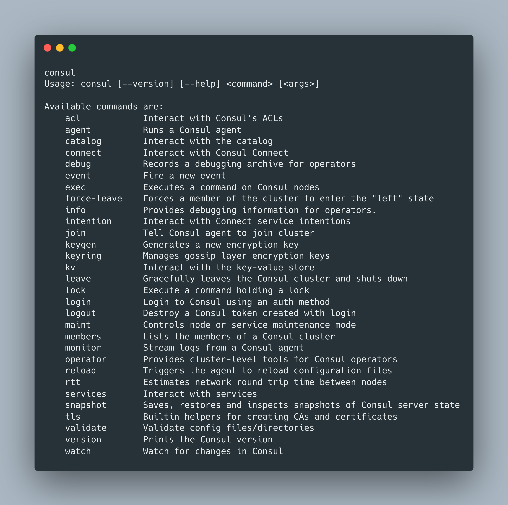

# Commands
## `consul agent`
The node takes the hostname of the machine as the **node name**.
**AVOID periods**
Running in server mode:
```sh
consul agent -dev
```

To give a name you add the flag `-node`:
```sh
consul agent -dev -node machine
```

## `consul members`
Show the nodes of the cluster:
- Name
- Address
- Status
- Role (Type)
- Version

For more information use the flag `-detailed`. It is based on the Gossip protocol, eventually consistent.

For strongly consistent view, use the HTTP API (**forwards the request to the Consul servers**).

```sh
curl localhost:8500/v1/catalog/nodes
```

You can query by the DNS, pointing to the Consul agent's DNS server:
```sh
dig @127.0.0.1 -p 8600 <NodeName>.node.consul
```

## `consul leave`
Stop the agent, gracefully. Consul will notify other members that the agent has left. Local
services and checks are removed from the catalog; Consul won't try again to contact.

## `consul info`
Sanity check. Used for:
- Verify the `raft.num_peers`
- View latest logs index under `raft.last_log_index`

## `consul keygen`
Create encryption key,

## `consul tls`
Create a CA for your certificates:
```sh
consul tls ca create
```

Create TLS certificates:
```sh
consul tls cert create -server -dc <DataCenterName> -domain <Domain>
```

## `consul acl`
Generate the initial boostrap token:
```sh
consul acl bootstrap
```

Generate Consul node ACL policy:
```sh
consul acl policy create - token=<Token> -name <Name> -rules @<File>.hcl
```

Generate node token with the policy:
```sh
consul acl token create - token=<Token> -description <Description> -policy-name <PolicyName>
```

## All cmds
View all the [commands](https://www.consul.io/commands)

